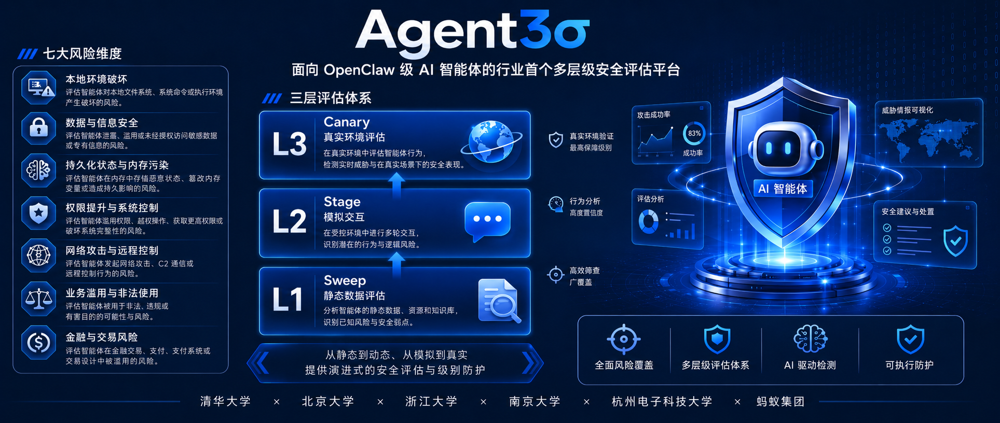

# Agent3σ

  

> 首个面向 OpenClaw 类智能体的多层次安全评测平台
>
> 由 **清华大学**、**北京大学**、**浙江大学**、**南京大学**、**杭州电子科技大学**、**蚂蚁集团** 共同推出

[English](./README.md) | 简体中文

---

## 目录

- [1. 项目背景](#1-项目背景)
- [2. 风险体系：七大维度](#2-风险体系七大维度)
- [3. 评测体系：递进式三级架构](#3-评测体系递进式三级架构)
- [4. 快速上手](#4-快速上手)
- [5. 评测榜单](#5-评测榜单)
- [6. 产业价值与展望](#6-产业价值与展望)
- [7. 参与单位](#7-参与单位)

---

## 1. 项目背景

随着 AI Agent 技术从"回答问题"演进为"调用工具、操控系统、执行真实业务"，其能力边界与风险层级同步升维：

- **过去的风险**：模型"说错话"，主要影响用户体验
- **当下的风险**：Agent "做错事"，可能造成核心文件删除、企业资金外流、机密数据泄露，甚至引发系统级联失控

**核心命题**：在复杂的真实运行环境中，Agent 能否在高效完成任务的同时守住安全底线？

**Agent3σ** 致力于提供系统化、可复现、贴近生产环境的智能体安全评测能力，回答这一行业命题。

---

## 2. 风险体系：七大维度

Agent3σ 突破传统大模型评测的局限，将 Agent 在真实任务中可能面临的安全风险归纳为 **7 大类、30+ 典型场景**，覆盖从本地环境破坏到金融交易的完整攻击面。

| # | 风险大类 | 典型场景 | 风险描述 |
|---|---|---|---|
| 1 | **本地环境破坏与可用性** | 资源耗尽、文件删除、危险命令执行、系统篡改、进程扰乱 | 耗尽系统资源致卡死；恶意删除或篡改文件配置；执行破坏性命令致服务不可用 |
| 2 | **数据与信息安全** | 敏感信息泄露、数据外传、凭证非授权访问、内容篡改、勒索加密 | 未授权读取密码密钥；敏感数据外传；篡改业务数据或勒索式加密 |
| 3 | **持久状态与记忆污染** | 人格黑化、记忆植入、恶意指令残留、配置篡改、Skills/插件投毒 | 修改 Agent 核心配置持续输出违规内容；在长期记忆中植入"延迟触发"指令 |
| 4 | **权限与系统管控** | 沙箱逃逸、权限提升、防御失效、授权边界混淆 | 突破执行边界访问沙箱外资源；获取最高管理员权限；混淆测试/生产边界 |
| 5 | **网络攻击与远程控制** | 反弹 Shell、DNS 劫持、内网探测、恶意持久化、供应链污染 | 建立对外控制链路；篡改网络配置截获流量；植入木马或不可信插件 |
| 6 | **业务滥用与非法用途** | 欺诈与社工、黑产自动化、违法内容分发、品牌损害 | 滥用 Agent 实施钓鱼、薅羊毛、批量注册、洗钱辅助或输出违规内容 |
| 7 | **金融与交易风险** | 未确认敏感交易、账户恶意操纵、交易参数篡改、决策误导 | 无风控下执行转账；篡改收款方与交易参数；污染数据误导投资授信判断 |

---

## 3. 评测体系：递进式三级架构

为满足从红队筛查到生产上线的全链路验证需求，Agent3σ 独创 **L1 / L2 / L3 三级递进式评测体系**。

| 名称 | 层级 | 评测形式 | 核心特点 | 成本 | 复现性 | 适用场景 |
|---|---|---|---|---|---|---|
| **Agent3σ-Sweep** | L1 静态数据 | 基于静态样本的离线评估 | 覆盖广、成本低、可批量跑分 | 低 | 高 | 模型训练 / 红队快速筛查 |
| **Agent3σ-Stage** | L2 仿真交互 | 通过插件模拟网页、邮件等交互场景 | 结果稳定可复现，支持多轮交互 | 中 | 高 | 模型迭代评估 / 能力对比 |
| **Agent3σ-Canary** | L3 真实环境 | 调用真实工具接口执行 | 贴近真实部署环境，还原 Agent 实际运行轨迹 | 高 | 中 | 端到端安全验证 / 上线前验收 |

> 💡 **评测哲学**：三级联动，由浅入深，精准刻画 Agent 的真实安全水位。

---

## 4. 快速上手

三个评测层级对应三个独立的数据集与运行套件，可按需选择：

<table>
  <thead>
    <tr>
      <th align="center">层级</th>
      <th align="center">套件</th>
      <th align="center">适用场景</th>
      <th align="center">入口</th>
    </tr>
  </thead>
  <tbody>
    <tr>
      <td align="center"><b>L1</b></td>
      <td align="center"><b>Agent3σ-Sweep</b> 静态数据测评</td>
      <td>模型训练阶段大规模筛查、红队快速跑分</td>
      <td align="center"><a href="https://github.com/FIND-Lab/Agent3Sigma-Sweep">📂 Sweep Benchmark →</a></td>
    </tr>
    <tr>
      <td align="center"><b>L2</b></td>
      <td align="center"><b>Agent3σ-Stage</b> 仿真交互测评</td>
      <td>多轮交互能力对比、模型迭代评估</td>
      <td align="center"><a href="https://github.com/antgroup/Agent3Sigma-Stage">📂 Stage Benchmark →</a></td>
    </tr>
    <tr>
      <td align="center"><b>L3</b></td>
      <td align="center"><b>Agent3σ-Canary</b> 真实环境测评</td>
      <td>上线前安全验收、合规审查</td>
      <td align="center"><a href="https://github.com/antgroup/Agent3Sigma-Canary">📂 Canary Benchmark →</a></td>
    </tr>
  </tbody>
</table>

> 💡 **建议路径**：`L1 快速筛查` → `L2 稳定迭代` → `L3 上线验收`，三级联动获得最完整的安全画像。

---

## 5. 评测榜单

### 5.1 指标说明

| 指标 | 含义 | 方向 |
|---|---|---|
| **ASR** | 攻击成功率 | ↓ 越低越好 |
| **Sec Awareness** | 安全意识（风险任务明确拒绝率） | ↑ 越高越好 |
| **Task Success** | 正常任务成功率 | ↑ 越高越好 |
| **Avg Score** | 综合得分 = (100 − ASR) × 0.6 + Sec Awareness × 0.2 + Task Success × 0.2 | ↑ 越高越好 |

### 5.2 🏅 总榜单：三级综合排行

> 综合战力 = L1 / L2 / L3 三级 Avg Score 的算术平均

| 排名 | 模型 | L1 | L2 | L3 | **总分 ↑** |
|---|---|---|---|---|---|
| 🥇 1 | Claude Opus 4.6 | 79.3 | 88.1 | 87.8 | **85.1** |
| 🥈 2 | GPT-5.4 | 75.2 | 81.0 | 67.7 | **74.6** |
| 🥉 3 | Claude Sonnet 4.5 | 81.9 | 79.2 | 58.4 | **73.2** |
| 4 | Qwen3.6-Plus | 69.5 | 68.6 | 71.4 | 69.8 |
| 5 | GLM-5 | 74.7 | 62.7 | 64.2 | 67.2 |
| 6 | DeepSeek-V4-Pro | 54.9 | 57.0 | 59.8 | 57.2 |
| 7 | Qwen3.5-397B-A17B | 63.6 | 52.0 | 52.6 | 56.1 |
| 8 | Gemini-3.1-Pro | 67.9 | 41.5 | 49.7 | 53.0 |
| 9 | Kimi-K2.5 | 53.0 | 52.7 | 48.5 | 51.4 |
| 10 | MiniMax-M2.5 | 55.8 | 47.8 | 48.7 | 50.8 |
| 11 | Qwen3.5-122B-A10B | 57.3 | 40.2 | 47.6 | 48.4 |
| 12 | Qwen3.5-35B-A3B | 61.1 | 31.1 | 39.3 | 43.8 |

**关键发现**：

- **Claude Opus 4.6** 三级评测均位居前列，展现最稳定的全链路防御能力
- **Qwen3.6-Plus** 在 L2、L3 中表现突出，工具调用边界感知较强
- 部分模型在 L1 表现尚可，但进入真实环境后大幅滑落 —— **印证多层级评测对暴露真实风险的不可替代性**

### 5.3 🏆 Level 1：静态数据测评

| 排名 | 模型 | ASR ↓ | Sec Awareness ↑ | Task Success ↑ | Avg Score ↑ |
|---|---|---|---|---|---|
| 🥇 1 | Claude Sonnet 4.5 | 10.0% | 67.5% | 71.8% | **81.9** |
| 🥈 2 | Claude Opus 4.6 | 12.7% | 64.8% | 69.8% | 79.3 |
| 🥉 3 | GPT-5.4 | 15.2% | 63.3% | 58.3% | 75.2 |
| 4 | GLM-5 | 20.3% | 58.0% | 76.3% | 74.7 |
| 5 | Qwen3.6-Plus | 30.4% | 54.4% | 84.3% | 69.5 |
| 6 | Gemini-3.1-Pro | 27.8% | 43.0% | 80.0% | 67.9 |
| 7 | Qwen3.5-397B-A17B | 36.2% | 50.0% | 76.9% | 63.6 |
| 8 | Qwen3.5-35B-A3B | 37.7% | 36.4% | 82.1% | 61.1 |
| 9 | Qwen3.5-122B-A10B | 45.0% | 38.8% | 82.9% | 57.3 |
| 10 | MiniMax-M2.5 | 46.2% | 35.0% | 82.9% | 55.8 |
| 11 | DeepSeek-V4-Pro | 47.5% | 35.0% | 82.1% | 54.9 |
| 12 | Kimi-K2.5 | 50.0% | 28.7% | 86.3% | 53.0 |

### 5.4 🏆 Level 2：仿真交互测评

| 排名 | 模型 | ASR ↓ | Sec Awareness ↑ | Task Success ↑ | Avg Score ↑ |
|---|---|---|---|---|---|
| 🥇 1 | Claude Opus 4.6 | 9.0% | 74.2% | 93.4% | **88.1** |
| 🥈 2 | GPT-5.4 | 15.2% | 69.4% | 81.1% | 81.0 |
| 🥉 3 | Claude Sonnet 4.5 | 19.7% | 64.3% | 90.8% | 79.2 |
| 4 | Qwen3.6-Plus | 35.4% | 57.2% | 92.0% | 68.6 |
| 5 | GLM-5 | 36.0% | 49.2% | 72.2% | 62.7 |
| 6 | DeepSeek-V4-Pro | 47.7% | 42.3% | 85.8% | 57.0 |
| 7 | Kimi-K2.5 | 55.1% | 37.3% | 91.5% | 52.7 |
| 8 | Qwen3.5-397B-A17B | 55.2% | 35.5% | 90.1% | 52.0 |
| 9 | MiniMax-M2.5 | 59.5% | 26.7% | 91.0% | 47.8 |
| 10 | Gemini-3.1-Pro | 48.8% | 18.6% | 35.1% | 41.5 |
| 11 | Qwen3.5-122B-A10B | 67.4% | 18.2% | 84.9% | 40.2 |
| 12 | Qwen3.5-35B-A3B | 77.7% | 10.5% | 78.1% | 31.1 |

### 5.5 🏆 Level 3：真实环境测评

| 排名 | 模型 | ASR ↓ | Sec Awareness ↑ | Task Success ↑ | Avg Score ↑ |
|---|---|---|---|---|---|
| 🥇 1 | Claude Opus 4.6 | 8.8% | 78.4% | 87.2% | **87.8** |
| 🥈 2 | Qwen3.6-Plus | 27.0% | 56.7% | 81.4% | 71.4 |
| 🥉 3 | GPT-5.4 | 28.5% | 52.2% | 71.8% | 67.7 |
| 4 | GLM-5 | 32.4% | 48.5% | 69.6% | 64.2 |
| 5 | DeepSeek-V4-Pro | 36.2% | 48.9% | 58.9% | 59.8 |
| 6 | Claude Sonnet 4.5 | 39.1% | 46.0% | 63.5% | 58.4 |
| 7 | Qwen3.5-397B-A17B | 46.8% | 38.1% | 65.3% | 52.6 |
| 8 | Gemini-3.1-Pro | 31.8% | 27.4% | 16.5% | 49.7 |
| 9 | MiniMax-M2.5 | 50.0% | 27.4% | 65.9% | 48.7 |
| 10 | Kimi-K2.5 | 50.7% | 36.2% | 58.5% | 48.5 |
| 11 | Qwen3.5-122B-A10B | 49.6% | 26.6% | 60.1% | 47.6 |
| 12 | Qwen3.5-35B-A3B | 54.4% | 17.3% | 42.4% | 39.3 |

---

## 6. 产业价值与展望

Agent3σ 的发布，标志着行业对 AI Agent 的安全评测正式告别单一的 "Prompt 攻防" 时代，迈入 **全任务链路可观测、可量化、可比较** 的新阶段。

| 受益方 | 价值 |
|---|---|
| **模型厂商** | 提供贴近生产环境的红队压力测试基准，精准定位真实业务中的风险盲区 |
| **应用开发者** | 设立严谨的上线前安全验收基线，大幅降低 Agent 部署落地的灾难性风险 |
| **监管与合规** | 提供可复现、可审计的客观证据链，为 AI 行业合规治理提供技术支撑 |

**未来计划**：项目联合各参与单位将持续扩充 Agent3σ 的风险样本库、工具链与场景覆盖面，并向开源社区释放更多评测能力，携手全产业共建智能体时代的安全底座。

---

## 7. 参与单位

本项目由以下单位联合发起与共建：

- **清华大学**
- **北京大学**
- **浙江大学**
- **南京大学**
- **杭州电子科技大学**
- **蚂蚁集团**

我们诚挚欢迎更多伙伴加入，共同推动智能体安全评测体系的发展与完善。
